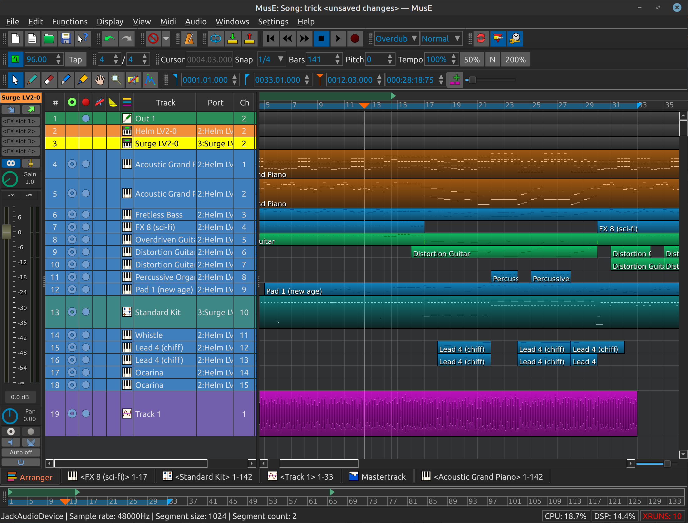

MusE
====
MusE is a MIDI/Audio sequencer with recording and editing capabilities written originally by 
 Werner Schweer now developed and maintained by the MusE development team. 
MusE aims to be a complete multitrack virtual studio for Linux.
It is published under the GNU General Public License. 

Visit the MusE web site at: https://muse-sequencer.github.io/

Most Linux distributions include MusE ready to install, check your package manager.

Installation from source code:
------------------------------
Stable source code releases are [here](https://github.com/muse-sequencer/muse/releases).
Or one of the git branches can be cloned, built, and installed.

Installation instructions are in the [README](src/README) file.

Documentation:
--------------
[LICENSE](src/COPYING)
[AUTHORS](src/AUTHORS)

These and other important documents, READMEs, and addendums are in the [src](src) directory.

The official MusE Manual (work in progress) has migrated to the wiki and can be found [here](https://github.com/muse-sequencer/muse/wiki/Documentation).
