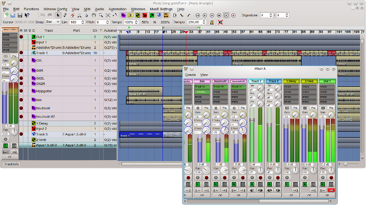

MusE
====
MusE is a MIDI/Audio sequencer with recording and editing capabilities written originally by 
 Werner Schweer now developed and maintained by the MusE development team. 
MusE aims to be a complete multitrack virtual studio for Linux.
It is published under the GNU General Public License. 

Visit the MusE web site at: http://www.muse-sequencer.org

Most Linux distributions include MusE ready to install, check your package manager.

Installation from source code:
------------------------------
Stable source code releases are [here](http://sourceforge.net/project/showfiles.php?group_id=93414).
Or one of the git branches can be cloned, built, and installed.

Installation instructions are in the [README](muse2/README) file. German version: [README.de](muse2/README.de).

Documentation:
--------------
[LICENSE](muse2/COPYING)
[AUTHORS](muse2/AUTHORS)

These and other important documents, READMEs, and addendums are in the [muse2](muse2) directory.

The official MusE manual can be found here in HTML or PDF form in the [muse2/doc](muse2/doc) directory. 
The manuals are also installed along with MusE.
